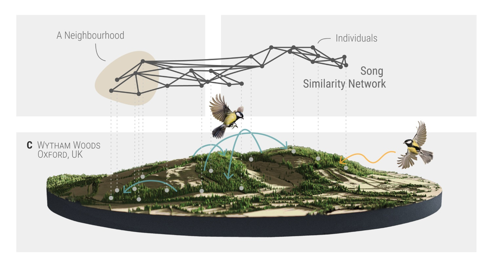

 




## Table of Contents

- [Table of Contents](#table-of-contents)
- [This Repository](#this-repository)
  - [Project Organization](#project-organization)
- [Getting Started](#getting-started)
  - [Installation](#installation)
  - [Dependencies](#dependencies)
- [Running the analyses](#running-the-analyses)
  - [Models](#models)
  - [Figures and model output](#figures-and-model-output)
- [Bugs and Issues](#bugs-and-issues)


## This Repository

This repository includes the following main features,

- An RStudio project [`birdsong-demography.Rproj`](./birdsong-demography.Rproj)
- Package dependency management using [`renv`](https://github.com/rstudio/renv/)
- Configuration using [`config`](https://github.com/rstudio/config)
- A [`scripts`](./scripts) directory with the code necessary to reproduce the analysis and figures in this paper.
- A [`R`](./R) folder for R source code and reusable functions

and uses the output of other dedicated repositories: 

- [Wytham Great Tit Song Dataset](https://github.com/nilomr/great-tit-hits-setup)
- [Song Type Validation](https://github.com/nilomr/wytham-songtype-validation)


### Project Organization

```text
...
├── data
│   ├── derived v                derived data, created by scripts
│   ├── fits                       model fits (brms .rds objects)
│   └── raw                         original data, never modified
├── output
│   └── figures
├── R                                          reusable functions
│   ├── io.R
│   ├── rplot.R
│   └── utils.R
├── renv 
├── scripts                        code to reproduce the analysis
│   ├── maps
│   ├── models
│   │   ├── fit
│   │   ├── plot
│   │   └── report
│   └── plots                extra plots (supplementary material)
├── scripts
│   ├── setup
│   └── pipeline.sh
...
├── .Rprofile                             main configuration file
├── config.yml                                 configuration file
├── dependencies.R                               IDE dependencies
├── LICENSE.md
├── README.md
├── renv.lock                     lockfile detailing dependencies
└── birdsong-demography.Rproj                RStudio project file
```

## Getting Started


### Installation

Clone this repository to your local computer using the following command in the terminal:
  
```bash
git clone https://github.com/nilomr/birdsong-demography.git
```

Then, download the data from [OSF](), replacing the `data` folder in the repository with the downloaded `data` folder[^1].


### Dependencies

This project uses R v4.2. You must have the [`renv` package](https://rstudio.github.io/renv/articles/renv.html) installed on your local computer. While in an active session, simply run the following line of code in the R Console.

```r
install.packages('renv')
```

To install the necessary libraries using `renv`, run the following line of code in the R Console:

```r
renv::restore()
```
Depending on your system, this may take a while, and you will likely be prompted (as in installation will just fail) to install some system dependencies.

## Running the analyses

### Models
Running the script that prepares the derived datasets is not necessary: you already downloaded the derived data from [OSF]()

If you do want to do this to make sure things work correctly, just `cd` into the `./scripts` folder and run `bash pipeline.sh` in the terminal. 

Similarly, the model fits are already in the data, so they will not refit automatically. If you want to refit them, change `file_refit = "never"` to `file_refit = "always"` in the relevant function calls.

### Figures and model output

Any scripts outside of the `./scripts/setup` and  `./scripts/models/fit` folders can be run independently. Where there is an order constraint, this is indicated in the script name.


## Bugs and Issues

If you encounter any bugs or issues, please [open an issue](https://github.com/nilomr/birdsong-demography/issues/new/choose). If possible, include a minimal reproducible example and/or screenshots to illustrate the problem.


<br>

[^1]: Data are under version control here, but obtaining these requires `git-lfs` to be installed on your computer and I can't guarantee that it will work.

<sub>
<br>© Nilo M. Recalde, 2023
</sub>


